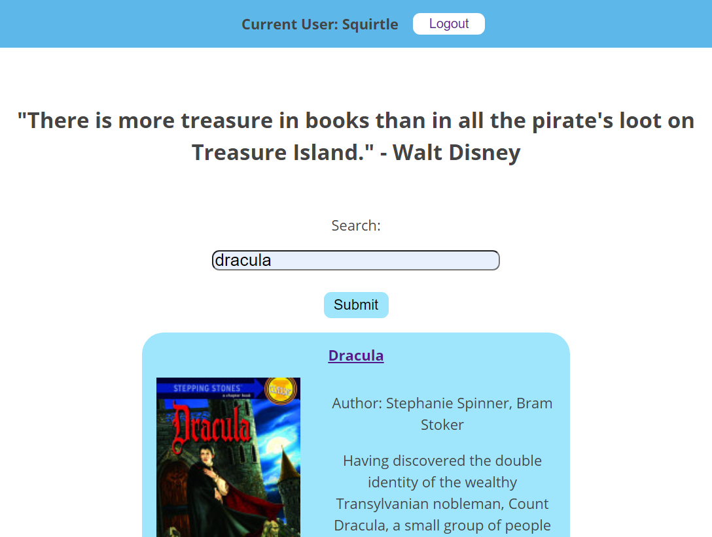
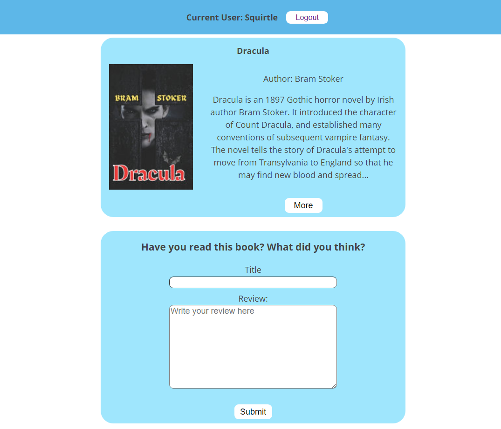

# BookTrove (API)

Try it out here: [https://booktrove-app.vercel.app](https://booktrove-app.vercel.app).

BookTrove Client repo: [https://github.com/orndorfftyler/booktrove-app](https://github.com/orndorfftyler/booktrove-app)

### Summary

BookTrove allows you to read and write reviews of your favorite books. Users first sign up or log in before accessing the search page. The search page is powered by Google Books and allows you to search for books in which you are interested. Clicking on a book in the search results brings you to a page which lists the reviews left for that book by other BookTrove users. Users may indicate which reviews they found useful and leave their own review.

### Tech Used

Built with HTML, CSS, JavaScript, React, React Router, Node.js, Express, Knex, PostgresSQL.  
Frontend deployed using Vercel. Backend deployed using Heroku.

### API Documentation

BookTrove API endpoints:

POST /api/auth/login
- returns a JWT if user credentials are valid 

GET /api/reviewsperbook/:book_id
- gets the reviews for a given book

POST /api/reviewsperbook/:book_id
- adds a review for a given book

DELETE /api/reviews/:review_id
- deletes a review

PATCH /api/reviews/:review_id
- updates an existing review

GET /api/helpfulreview/:review_id
- gets a list of which users found a given review helpful

POST /api/helpfulreview/:review_id
- adds to the list of which users found a given review helpful

POST /api/users/
- creates a new user/pw combo

### Screenshots

Login page:

Search page:

Book review page:

